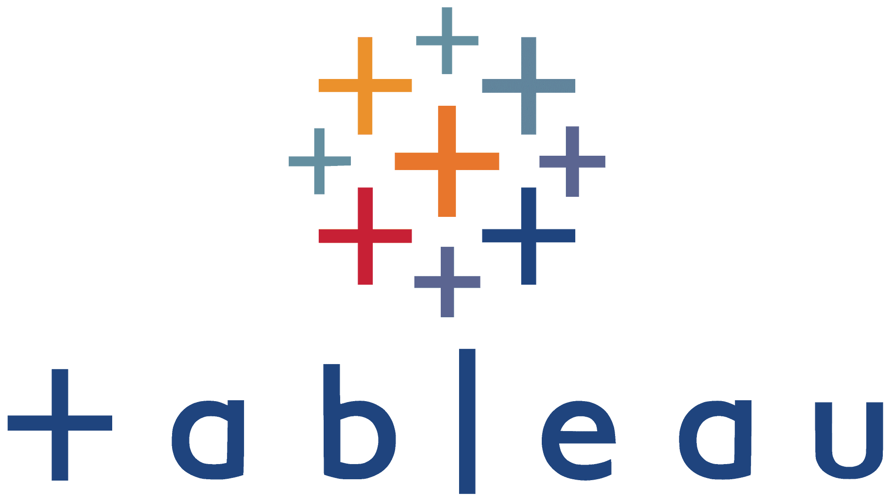

  
  
  <a href="https://www.linkedin.com/in/micael-donadia/" target="_blank">
  <a href="https://www.kaggle.com/micaeld" target="_blank">
  <a href="mailto:micaeldonadia18@gmail.om" target="_blank">

 

  <table align='center'>
    <tr>
      <td align='center'></td>
      <td align='center'></td>
      <td align='center'></td>
      <td align='center'></td>
      <td align='center'></td>
      <td align='center'></td>
     </tr>
     <tr>
      <td align='center'></td>
      <td align='center'></td>
      <td align='center'></td>
       <td align='center'></td>
      <td align='center'></td>
      <td align='center'></td>
     </tr>
  </table>

  
  
  

   
  

    

